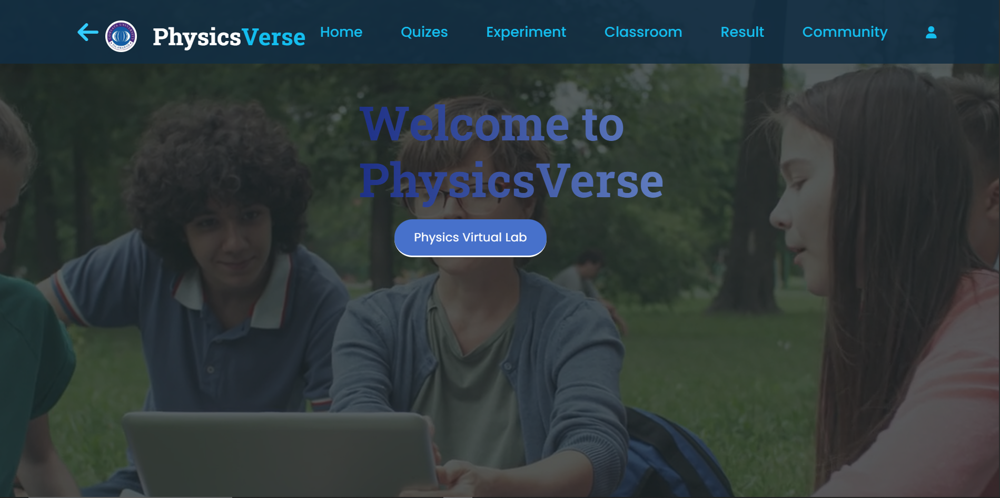
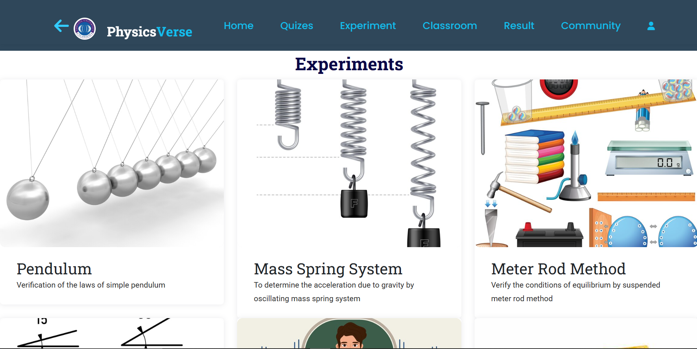

# 🌌 PhysicsVerse — A Virtual Physics Lab for Interactive Learning

**PhysicsVerse** is a web-based virtual lab designed to simulate real-world physics experiments in an engaging and educational digital environment. This system allows both **students and teachers** to perform, observe, analyze, and assess physics experiments virtually — anywhere, anytime.

> 🚀 Final Year Project (BSCS 2021–2025)
> COMSATS University Islamabad, Attock Campus

---

## 📚 Table of Contents

* [📚 Overview](#overview)
* [🔬 Experiments Included](#experiments-included)
* [✨ Key Features](#key-features)
* [🛠️ Technologies Used](#technologies-used)
* [🚀 Getting Started](#getting-started)
* [📸 Screenshots](#screenshots)
* [👨‍💻 Authors](#authors)
* [📜 License](#license)

---

## 📚 Overview

PhysicsVerse bridges the gap between theoretical knowledge and practical experimentation through:

* Interactive simulations with real-time data visualization.
* Role-based portals for teachers and students.
* Guided experiments and custom experiment creation.
* Graded assessments and collaborative learning via live chat.

It is ideal for educational institutions looking to provide flexible, remote, and engaging physics learning experiences.

---

## 🔬 Experiments Included

PhysicsVerse includes **five core physics experiments**, each explained, animated, and interactive:

1. **Simple Pendulum Laws**

   * Time period independence of amplitude.
   * Time period independence of mass.
   * Time period proportional to √length.

2. **Mass-Spring System**

   * Determine gravitational acceleration (g) using SHM.

3. **Suspended Meter Rod Method**

   * Verify conditions of equilibrium using torque and force balance.

4. **Rectangular Component of Forces**

   * Determine unknown weight using the parallelogram law of vectors.

5. **Resonance Tube Apparatus**

   * Determine speed of sound in air using resonance and end correction.

---

## ✨ Key Features

### 👨‍🎓 Student Portal

* Email-based signup and OTP verification.
* Access guided experiments with step-by-step instructions.
* Create custom experiments by adjusting parameters (mass, angle, etc.).
* Participate in graded quizzes and receive instant feedback.
* Chat in real-time with teachers and peers for help.

### 👩‍🏫 Teacher Portal

* Manage student registrations and performance.
* Create and assign guided or custom experiments.
* Upload teaching resources.
* View analytics for student activity and quiz performance.

### 🔐 Authentication & Security

* JWT token-based login sessions.
* Password hashing with `bcrypt`.
* Email verification with OTP using Gmail and `nodemailer`.

---

## 🛠️ Technologies Used

| Layer           | Stack                             |
| --------------- | --------------------------------- |
| **Frontend**    | HTML5, CSS3, Bootstrap, EJS       |
| **Backend**     | Node.js, Express.js               |
| **Database**    | MongoDB + Mongoose                |
| **Auth**        | JWT, bcrypt                       |
| **Email**       | Nodemailer (with Gmail SMTP)      |
| **Simulations** | HTML5 Canvas, Matter.js, anime.js |
| **UI Design**   | Figma (mockups & wireframes)      |

---

## 🚀 Getting Started

### 1. Clone the repository

```bash
git clone https://github.com/TubaJabeen123/PhysicsVerse.git
cd PhysicsVerse
```

### 2. Install dependencies

```bash
npm install
```

### 3. Start the application

```bash
node index.js
```

Then open [http://localhost:5013](http://localhost:5013) in your browser.

---

## 📸 Screenshots




---

## 👨‍💻 Authors

* **Tuba Jabeen** — [FA21-BCS-033](mailto:fa21-bcs-033@cuiatk.edu.pk)
* **Isha Eman** — [FA21-BCS-046](mailto:fa21-bcs-046@cuiatk.edu.pk)

**Supervisor:** Mr. Muhammad Kamran
**Co-Supervisor:** Dr. Umair Hassan

---

## 📜 License

This project is for educational use and submitted as a final year project at COMSATS University Islamabad, Attock Campus.
